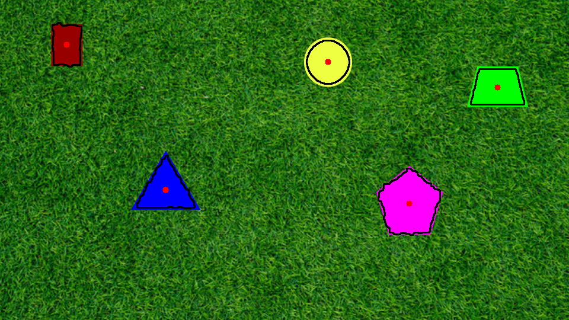

# PennAiR Software Challenge — Shape Detection

Detecting solid shapes on a background, tracing their outlines, locating their
centres, and estimating the 3D position of the circle — across a static image, two
videos, and a background-agnostic case.

## Approach in brief

Detection is **texture-based**, not colour-based: shapes are smooth (low local pixel
variation) while backgrounds are busy (high variation). This makes detection
colour-blind, so it works regardless of shape colour or background colour. The core
detector is written once and reused across every part. Full reasoning and trade-offs
are in [DESIGN_NOTES.md](DESIGN_NOTES.md).

## Repository contents

| File | What it does |
|------|--------------|
| `part1.py` | Core detector (reusable). Detects shapes in the static image, outlines them, marks centres. |
| `part2.py` | Runs the detector frame-by-frame on the standard video. |
| `part3.py` | Runs the detector on the harder, different-background video. |
| `part4.py` | Estimates the circle's real-world 3D position (X, Y, depth) from its apparent size. |
| `DESIGN_NOTES.md` | Design decisions and trade-offs for each part. |

## Setup

```bash
python3 -m venv .venv
source .venv/bin/activate        # Windows: .venv\Scripts\activate
pip install opencv-python numpy
```

Place the challenge media in the repo root, renamed as: `static.png`,
`dynamic.mp4`, `hard.mp4`.

## Running

```bash
python part1.py     # -> part1_output.png, mask.png
python part2.py     # -> part2_output.mp4
python part3.py     # -> part3_output.mp4
python part4.py     # -> part4_output.png (circle labelled with depth)
```

## Results

### Part 1 — Static image
All five shapes detected, outlined, and centre-marked.



### Part 2 — Video
_Screen recording:_ [add YouTube link]

### Part 3 — Background-agnostic video
The same detector, unchanged, on a completely different background.

_Screen recording:_ [add YouTube link]

### Part 4 — 3D position
Circle labelled with its estimated depth.


## Notes

- Detection parameters (`texture_thresh`, `win`, `min_area`) are passed per-video
  rather than hard-coded, so each input can be tuned without changing the shared
  detector.
- Part 4 is applied to the circle only, as it is the only shape with a supplied real
  dimension. See DESIGN_NOTES.md for the full reasoning.
